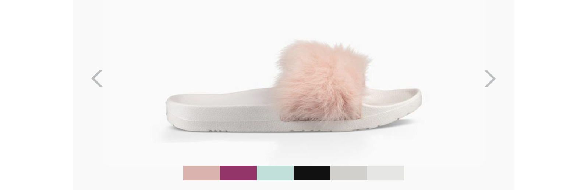

<p align="center">
  <a href="https://www.react-mailkit.io">
  
  </a>
</p>

<h2 align="center">
  Welcome to react-mailkit 
</h2>

<p align="center">
  <a href="https://twitter.com/intent/tweet?text=@reactjs%20@mjmlio%20Create%20awesome%20and%20fully%20responsive%20emails%20without%20stress.&url=https://github.com/pavkout/react-mailkit&hashtags=react,email,templates,blocks,developers" target="_blank">
    
  </a>
<p>
<p align="center"></p>

<p align="center" style="font-size: 18px">
  <a href="https://www.react-mailkit.io">
  www.react-mailkit.io 
  </a>
</p>

<p align="center">


</p>

---

[](https://app.codacy.com/gh/pavkout/react-mailkit?utm_source=github.com&utm_medium=referral&utm_content=pavkout/react-mailkit&utm_campaign=Badge_Grade_Settings)

> Once upon a time, email creation wasn't an easy part using pure `html` and `css`.
>
> `Now it is!` Create awesome and fully responsive emails without stress.

## Documentation

### You can see more docs and examples in our [Storybook](https://pavkout.github.io/react-mailkit).

## Getting Started

### What We Use

 &middot;  &middot; 

## 📦 Install

```bash
yarn add react-mailkit
```

OR

```bash
npm install react-mailkit
```

## 👨‍💻 Tests

Over 350 🆙 unit tests

## ✍️ Example

```js
import {
  useEmail,
  EMail,
  EHead,
  ETitle,
  EPreview,
  EBody,
  ESection,
  EColumn,
  ECarousel,
  ECarouselImage
} from 'react-mailkit';

const { html, errors } = useEmail(
  <EMail>
    <EHead>
      <ETitle>Example</ETitle>
      <EPreview>Example</EPreview>
    </EHead>
    <EBody width={600}>
      <ESection>
        <EColumn width='550px'>
          <ECarousel
            iconWidth='16px'
            leftIcon='https://static.cdn.responsys.net/i2/responsysimages/uggs/contentlibrary/promotional/2017/06-june/20170615_u_royale-b/images/arrow-left.png'
            rightIcon='https://static.cdn.responsys.net/i2/responsysimages/uggs/contentlibrary/promotional/2017/06-june/20170615_u_royale-b/images/arrow-right.png'
            tbBorder='0px'
            tbBorderRadius='0px'
            tbHoverBorderColor='red'
            tbWidth='50px'
          >
            <ECarouselImage
              alt='Side view of the Royal in Baby Pink'
              href='http://www.ugg.com/'
              src='https://static.cdn.responsys.net/i2/responsysimages/uggs/contentlibrary/promotional/2017/06-june/20170615_u_royale-b/images/product1.jpg'
              thumbnailsSrc='https://static.cdn.responsys.net/i2/responsysimages/uggs/contentlibrary/promotional/2017/06-june/20170615_u_royale-b/images/BPNK.gif'
            ></ECarouselImage>
            <ECarouselImage
              href='http://www.ugg.com/'
              src='https://static.cdn.responsys.net/i2/responsysimages/uggs/contentlibrary/promotional/2017/06-june/20170615_u_royale-b/images/product2.jpg'
              thumbnailsSrc='https://static.cdn.responsys.net/i2/responsysimages/uggs/contentlibrary/promotional/2017/06-june/20170615_u_royale-b/images/NOPK.gif'
            ></ECarouselImage>
            <ECarouselImage
              href='http://www.ugg.com/'
              src='https://static.cdn.responsys.net/i2/responsysimages/uggs/contentlibrary/promotional/2017/06-june/20170615_u_royale-b/images/product3.jpg'
              thumbnailsSrc='https://static.cdn.responsys.net/i2/responsysimages/uggs/contentlibrary/promotional/2017/06-june/20170615_u_royale-b/images/BBLU.gif'
            ></ECarouselImage>
            <ECarouselImage
              alt='Side view of the Royal in Black'
              href='http://www.ugg.com/'
              src='https://static.cdn.responsys.net/i2/responsysimages/uggs/contentlibrary/promotional/2017/06-june/20170615_u_royale-b/images/product4.jpg'
              thumbnailsSrc='https://static.cdn.responsys.net/i2/responsysimages/uggs/contentlibrary/promotional/2017/06-june/20170615_u_royale-b/images/BLK.gif'
            ></ECarouselImage>
            <ECarouselImage
              alt='Side view of the Royal in Seal'
              href='http://www.ugg.com/'
              src='https://static.cdn.responsys.net/i2/responsysimages/uggs/contentlibrary/promotional/2017/06-june/20170615_u_royale-b/images/product5.jpg'
              thumbnailsSrc='https://static.cdn.responsys.net/i2/responsysimages/uggs/contentlibrary/promotional/2017/06-june/20170615_u_royale-b/images/SEL.gif'
            ></ECarouselImage>
            <ECarouselImage
              alt='Side view of the Royal in White'
              href='http://www.ugg.com/'
              src='https://static.cdn.responsys.net/i2/responsysimages/uggs/contentlibrary/promotional/2017/06-june/20170615_u_royale-b/images/product6.jpg'
              thumbnailsSrc='https://static.cdn.responsys.net/i2/responsysimages/uggs/contentlibrary/promotional/2017/06-june/20170615_u_royale-b/images/WHT.gif'
            ></ECarouselImage>
          </ECarousel>
        </EColumn>
      </ESection>
    </EBody>
  </EMail>
);
```

And this is the result (works in mobile too!)



## ✍️ Example project

You can find an example project
[here](https://github.com/pavkout/react-mailkit/tree/main/packages/react-mailkit-example)

## ⌨️ Try it live

You can try it [live](https://www.react-mailkit.io/#/try-it-live)

## TODO

- Add ability to convert the MJML format to react-mailkit via js and CLI. (Working)
- Add more custom components

## Reporting Bugs

Have a bug or a feature request? Please open a new
[bug report](https://github.com/pavkout/react-mailkit/issues).

Before opening a new issue, please search through any [existing issues](https://github.com/pavkout/react-mailkit/issues)
to avoid submitting duplicates.

## Contributing

All contributions are welcome! ❤️

## License Information

```
MIT License

Copyright (C) 2021

Permission is hereby granted, free of charge, to any person obtaining a copy
of this software and associated documentation files (the "Software"), to deal
in the Software without restriction, including without limitation the rights
to use, copy, modify, merge, publish, distribute, sublicense, and/or sell
copies of the Software, and to permit persons to whom the Software is
furnished to do so, subject to the following conditions:

The above copyright notice and this permission notice shall be included in
all copies or substantial portions of the Software.

THE SOFTWARE IS PROVIDED "AS IS", WITHOUT WARRANTY OF ANY KIND, EXPRESS OR
IMPLIED, INCLUDING BUT NOT LIMITED TO THE WARRANTIES OF MERCHANTABILITY,
FITNESS FOR A PARTICULAR PURPOSE AND NONINFRINGEMENT. IN NO EVENT SHALL THE
AUTHORS OR COPYRIGHT HOLDERS BE LIABLE FOR ANY CLAIM, DAMAGES OR OTHER
LIABILITY, WHETHER IN AN ACTION OF CONTRACT, TORT OR OTHERWISE, ARISING FROM,
OUT OF OR IN CONNECTION WITH THE SOFTWARE OR THE USE OR OTHER DEALINGS IN
THE SOFTWARE.
```
